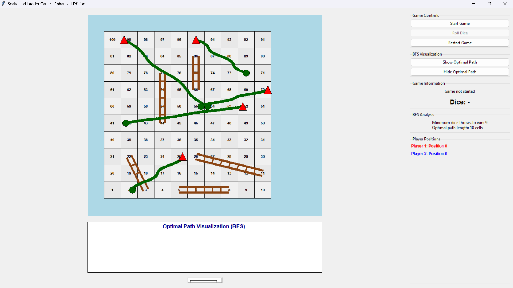
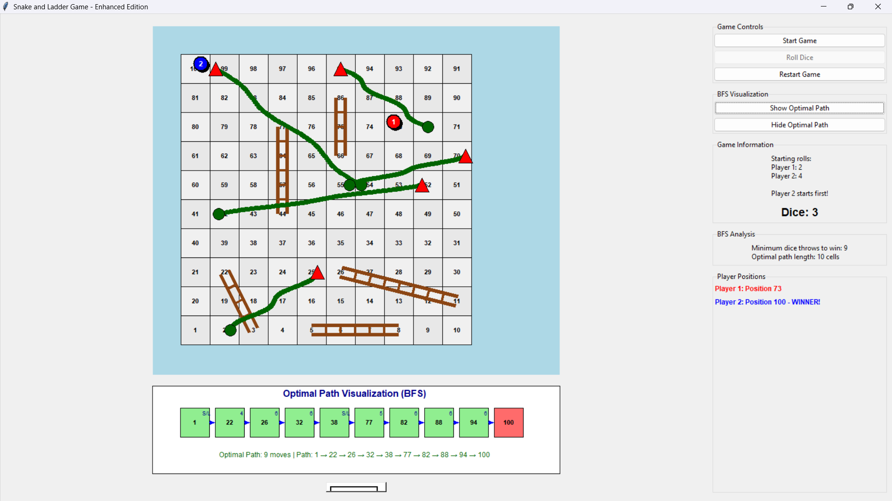
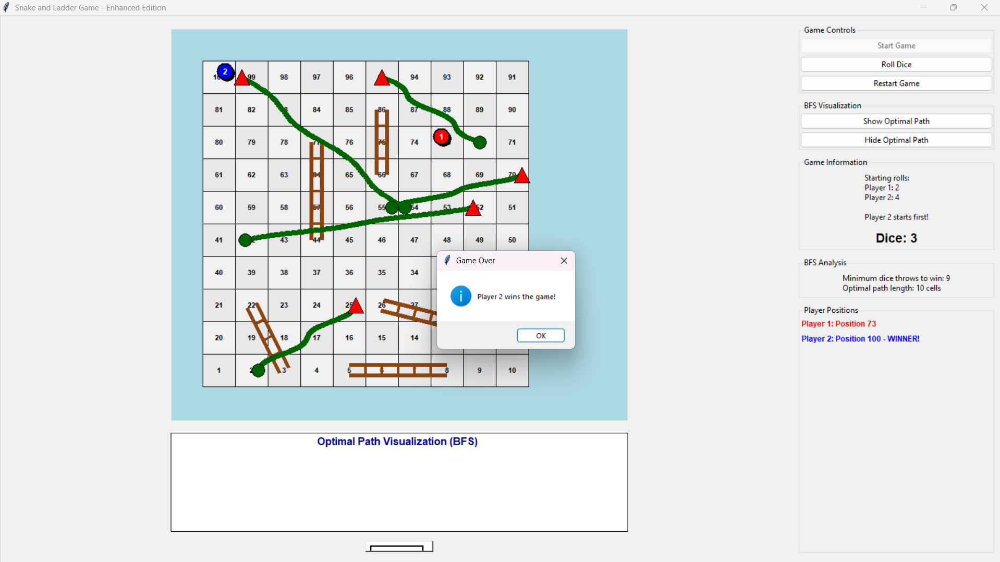

# Snake and Ladder Game with BFS Path Analysis

A Python-based Snake and Ladder game built using Tkinter featuring interactive gameplay, object-oriented design, and BFS-based optimal path analysis.

## Features

* Interactive GUI using Tkinter
* Classic Snake and Ladder gameplay
* Multiplayer support
* BFS-based minimum move calculation
* Optimal path visualization
* Object-Oriented Programming (OOP)
* Custom board rendering

## Technologies Used

* Python
* Tkinter
* BFS (Breadth First Search)
* Data Structures & Algorithms
* OOP

## Screenshots

### Game Board



### Optimal Path Visualization



### Winner Screen



## How to Run

```bash
python snake_and_ladder.py
```

## Author

Shaikh Fuzail
